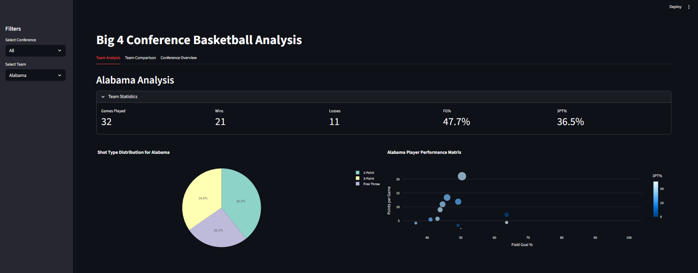
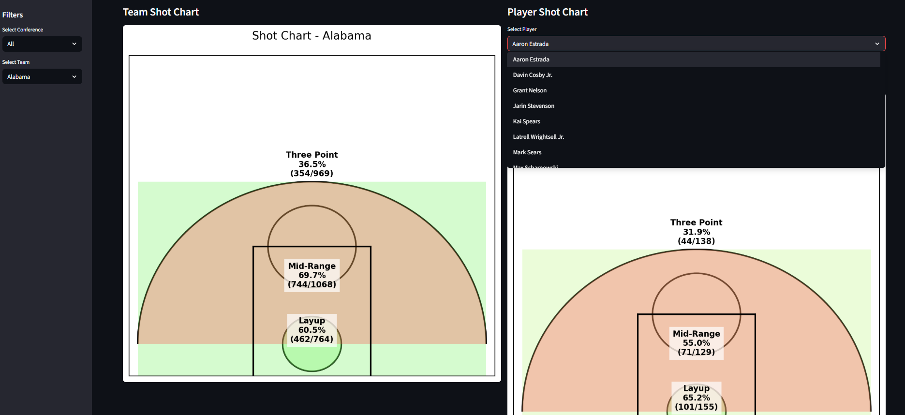
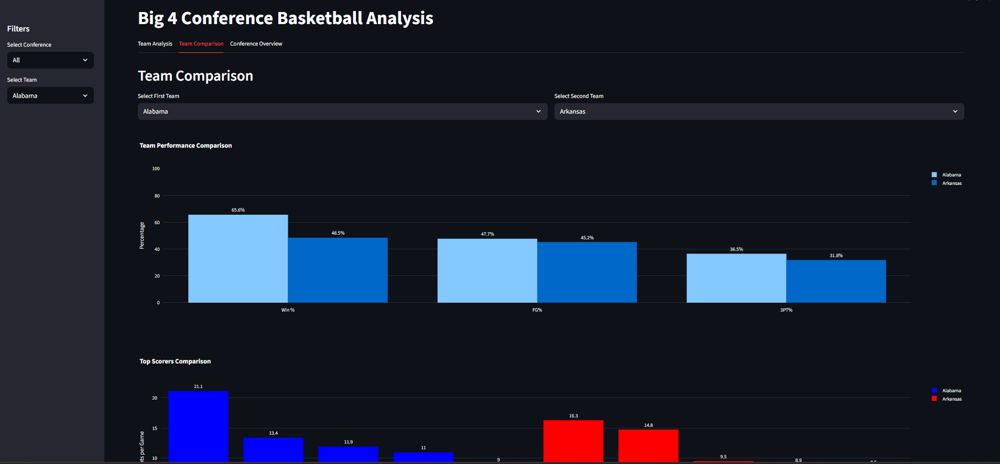
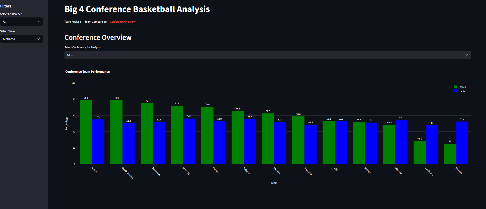

# NCAA Big 4 Conference Basketball Dashboard

An interactive Streamlit dashboard for analyzing NCAA basketball performance across the SEC, Big Ten, Big 12, and ACC conferences. Built with Python, Plotly, and Matplotlib.



## Features

- **Team Analysis** — view win/loss record, FG%, and 3PT% for any team across the four major conferences
- **Shot Charts** — custom-drawn basketball court visualizations showing shooting percentage by zone (layup, mid-range, three-point) for both teams and individual players
- **Player Performance Matrix** — scatter plot comparing points per game, FG%, and 3PT% across a team's roster
- **Team Comparison** — side-by-side stat comparison and top scorer breakdowns between any two teams
- **Conference Standings** — win percentage and FG% rankings for all teams within a selected conference

## Screenshots

### Shot Charts


### Team Comparison


### Conference Overview


## Tech Stack

- Python, Pandas, NumPy
- Plotly (interactive charts)
- Matplotlib (custom shot chart court rendering)
- Streamlit (dashboard UI)

## Getting Started

**Install dependencies:**
```bash
pip install -r requirements.txt
```

**Run the dashboard:**
```bash
streamlit run code/final_dashboard.py
```

The dataset loads automatically from a hosted source — no manual download needed.

## Project Structure

```
├── assets/                      # Screenshots
├── code/
│   ├── basketball_analysis.py   # Data processing and visualization functions
│   └── final_dashboard.py       # Streamlit app
├── tests/
│   └── test_basketball_analysis.py
└── requirements.txt
```

## Author

Jacob VonTersch — [@Tersch23](https://github.com/Tersch23)  
Data Analytics, Syracuse University iSchool